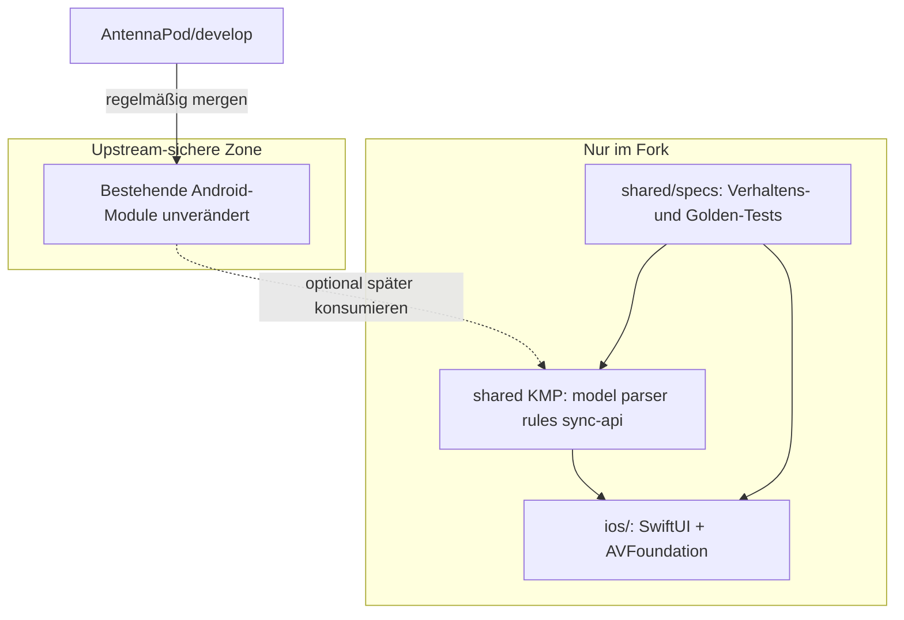

# AntennaPod iOS + schmaler KMP-Kern

Ziel: Feature-Parität mit der Android-App (gewichtete Phasen), Upstream-Mergebarkeit erhalten, doppelte Pflege minimieren.

## Empfehlung zu „KMP von Anfang an?“

**Ja für einen schmalen Shared-Core. Nein für „alles in KMP“.**

| Ansatz | Urteil |
|--------|--------|
| Volles KMP-Rewrite (Playback, DB, Download, UI teilen) | Ungeeignet: AntennaPod ist ~99 % Java; `commonMain` braucht Kotlin; UI/Playback/Download sind plattformgebunden; Upstream-Merges würden leiden |
| Reines Swift zuerst, KMP „irgendwann“ | Riskant: Modelle/Parser/Regeln driftten; spätere Extraktion teurer |
| **Schmaler KMP-Kern ab Tag 1 + native SwiftUI/AVFoundation** | Empfohlen: Shared für Domain/Parser/Regeln/Sync-Protokoll; iOS- und Android-Shells native |

Begründung (Upstream-Forum + JetBrains-Migrationsleitfaden): Ohne Java→Kotlin und ohne Ablösung Android-only-APIs gibt es praktisch nichts Wiederverwendbares. Die Modulstruktur von AntennaPod (`:model` ist bereits „plain Java, no Android“) ist aber eine gute Extraktionsbasis — wenn wir **neue** KMP-Module im Fork anlegen und den bestehenden Android-Tree nicht umbauen.



## Repo-Layout (bestätigt)

```
/
├── app/, model/, parser/, …     # Android wie Upstream — keine iOS-bedingten Umbauten
├── shared/                      # NEU, nur Fork
│   ├── kmp/                     # Kotlin Multiplatform (commonMain + androidMain stubs)
│   └── specs/                   # Plattformneutrale Verhaltensspecs / Golden Files
├── ios/                         # NEU: Xcode/SwiftPM App
└── docs/ios/                    # Architektur, Feature-Matrix, Merge-Playbook
```

**Merge-Regeln**
- `upstream/develop` → Fork-`develop` regelmäßig mergen; Konflikte nur in Fork-only-Pfaden akzeptieren.
- Bestehende Android-Module nicht für iOS anfassen (keine Java→Kotlin-Migration im Upstream-Tree).
- KMP lebt unter `shared/kmp/`; Android darf ihn später optional nutzen, muss es aber nicht.
- CI: Android-Jobs unverändert; zusätzliche Jobs nur für `shared/` und `ios/`.

## Was gehört in KMP (Phase 0–1)

| Kandidat | Warum teilen | Aufwand |
|----------|--------------|---------|
| Domain-Modelle (`Feed`, `FeedItem`, `FeedMedia`, `Chapter`, Queue-Zustände) | `:model` ist schon plattformfrei | Mittel (Java→Kotlin Kopie in `shared/kmp`) |
| Feed-Parsing (RSS/Atom → Model) | Kernverhalten, viele Edge-Cases | Hoch (SAX → multiplatform XML, z. B. `kotlinx`/`com.fleeksoft.ksoup` o. ä.) |
| Geschäftsregeln | Auto-Download-Kandidaten, „neu/gespielt“, Sortierung, Filter, Queue-Policy | Mittel — als reine Funktionen + Specs |
| Discovery-API-Clients (iTunes/fyyd-Verträge) | HTTP + JSON, wenig UI | Mittel (`ktor` + Serialisierung) |
| gpodder.net Sync-Protokoll | REST-Verträge, Diff-Logik | Mittel–Hoch |
| OPML Import/Export | Text/XML, plattformfrei | Niedrig–Mittel |

## Was bewusst **nicht** in KMP (native pro Plattform)

| Bereich | Android | iOS |
|---------|---------|-----|
| UI | Views/Fragments | SwiftUI |
| Playback | Media3 / PlaybackService | AVFoundation / MediaPlayer / Now Playing |
| Downloads / Background | DownloadService, WorkManager | URLSession + BGTasks |
| Persistenz | raw SQLite `PodDBAdapter` | GRDB oder SQLite.swift (Schema an AntennaPod angelehnt) |
| Preferences UI | `:ui:preferences` | Settings-SwiftUI |
| Cast / Wear / Widget | Cast, Wear OS, App-Widget | AirPlay, optional WidgetKit später |
| Notifications | Android channels | UNUserNotificationCenter |

Persistenz: **Schema/Semantik** teilen (Tabellen, Felder, Migrationsregeln als Spec), **Implementierung** native — vermeidet KMP-SQLite-Komplexität und hält Upstream-DB unberührt.

## Feature-Gewichtung (Parität = Zielbild)

Gewichte 1–5 (5 = zuerst). Entschiedene Defaults:

### P0 — Kernprodukt (Gewicht 5)
- Abonnements (URL + OPML)
- Feed aktualisieren / Episodenliste
- Queue
- Stream-Playback (Lockscreen / Now Playing, Speed, Sleep Timer Basis)
- Offline-Downloads + Speicherverwaltung (gleichrangig mit Streaming)
- Fortschritt speichern / Fortsetzen
- Markiert gespielt / ungespielt
- Basis-Einstellungen (Theme hell/dunkel, Speed-Default)

### P1 — Alltag (Gewicht 4)
- gpodder.net / Nextcloud-gpodder Sync
- Suche in Bibliothek
- Podcast-Discovery (iTunes o. ä.)
- Kapitel
- Home / Inbox / Episodes-Übersicht analog Android-Navigation
- Automatische Downloads (Regeln aus KMP)

### P2 — Sync & Import (Gewicht 3)
- AntennaPod-Backup Import/Export (DB-Format)
- Favoriten / Tags (falls im Android-Stand relevant)

### P3 — Komfort (Gewicht 2)
- Transkripte
- Statistik
- Echo (Year in Review)
- Erweiterte Sleep-Timer / Volume Adaption / Skip Silence (soweit iOS-APIs erlauben)

### P4 — Plattform-Extras / niedrige Priorität (Gewicht 1)
- Video-Episoden (bewusst nachrangig)
- Homescreen-Widget
- CarPlay
- Siri Shortcuts
- Watch-Begleiter
- Chromecast-Parität → AirPlay reicht oft

**Definition of Done Parität:** P0–P2 feature-gleich im Alltag; P3–P4 wo iOS-Äquivalente sinnvoll sind, nicht 1:1 pixelgleich.

## Phasenplan

### Phase 0 — Fundament (ohne Feature-UI)
1. Fork von `AntennaPod/develop` syncen; Branch-Strategie: `develop` = Upstream-Spiegel + Fork-only-Ordner.
2. `docs/ios/FEATURE-MATRIX.md` aus Android-Screens/Settings ableiten (Gewicht + Status).
3. `shared/specs`: Golden Feeds (RSS/Atom Fixtures) + erwartete Model-Snapshots aus Android-`:parser:feed`-Tests portieren.
4. `shared/kmp` anlegen: leeres Multiplatform-Modul, XCFramework-Export, SwiftPM/Xcode-Anbindung unter `ios/`.
5. CI: `./gradlew :app:assembleDebug` muss weiter grün sein; KMP/iOS-Jobs separat (GitHub Actions, inkl. macOS-Runner für iOS).

### Phase 1 — Shared Spine + iOS Skeleton
1. KMP: Domain-Modelle (Kotlin-Port von `:model`, **Kopie**, kein Replace).
2. KMP: Feed-Parser hinter gemeinsamer API; Specs müssen gegen Fixtures grün sein.
3. iOS: SwiftUI Shell (Tab-Navigation grob wie Android), Repository-Protokoll, In-Memory oder SQLite-Store.
4. Erster End-to-End: Feed-URL → parsen (KMP) → Liste → Stream (AVPlayer) **und** Download-Pfad.

### Phase 2 — P0 fertigstellen
Queue, Persistenz (Schema-Specs), Playback-Session, Downloads, Fortschritt, Basis-Settings. Android unverändert weiterentwickelbar.

### Phase 3 — P1
Discovery (KMP-Clients), Kapitel, Auto-Download-Regeln in KMP, gpodder/Nextcloud Sync-Protokoll in KMP, UI-Parität Navigation.

### Phase 4 — P2
Backup/OPML; Konfliktstrategie dokumentieren (AntennaPod-Semantik übernehmen).

### Phase 5 — P3/P4 nach Nutzen
Transkripte, Stats, Echo, Widget, CarPlay, Video — einzeln priorisieren.

### Phase 6 — Optional Android auf KMP umstellen
Nur wenn stabil: Android hängt schrittweise von `shared/kmp` ab statt von lokalen Java-Kopien. Das ist ein **separates** Upstream-freundliches Refactoring — nicht Blocker für iOS.

## Doppelte Pflege vermeiden — konkrete Taktiken

1. **Eine Wahrheitsquelle für Regeln:** Sortierung, Filter, „isNew“, Download-Kandidaten nur in KMP; beide UIs rufen dieselbe API.
2. **Specs vor Code:** Jede Regel bekommt einen Test in `shared/specs` (oder `commonTest`); iOS/Android regressieren dagegen.
3. **Keine UI teilen:** Compose Multiplatform / RN bewusst auslassen — spart Upstream-Konflikt und Design-Schuld.
4. **Schema als Vertrag:** SQL-Migrationsbeschreibungen + Feldliste versioniert; zwei Implementierungen, ein Vertrag.
5. **Strings:** Langfristig Export aus `:ui:i18n` oder Weblate → iOS `.xcstrings`; kurzfristig manuell P0-Subset.

## Risiken

| Risiko | Mitigation |
|--------|------------|
| Java nicht in `commonMain` | Nur **Kopien** in KMP; Upstream-Java bleibt |
| Parser-Abweichungen | Golden-File-Tests aus Android-Fixtures |
| KMP-Toolchain bremst iOS | XCFramework in CI bauen; lokales Cache; SKIE nur wenn nötig |
| Scope „alles auf einmal“ | Gewichte P0→P4; Parität ist Zielbild, nicht Sprint-1 |
| Upstream-Merge-Konflikte | Fork-only-Pfade; nie Android-Module für iOS anfassen |
| DB-Semantik drift | Import-Tests mit echten AntennaPod-Backups |

## Erste konkrete Lieferungen (Reihenfolge)

1. Feature-Matrix + Gewichte in `docs/ios/` ✅
2. Repo-Ordner `shared/kmp`, `shared/specs`, `ios/` + README/Merge-Playbook ✅
3. KMP-Model + Golden Feed-Tests ✅ (RSS/Atom Basisparser + 5 Fixtures)
4. iOS-App: subscribe-by-URL → play **und** download ✅ (SwiftUI skeleton; KMP-Framework-Anbindung folgt)
5. Queue + Persistenz (Queue in-memory ✅; Persistenz folgt)
6. Danach P1 nach Matrix (inkl. gpodder Sync)

## Entschiedene Gewichtung

| Thema | Entscheidung |
|-------|--------------|
| gpodder / Nextcloud Sync | **P1** |
| Video-Episoden | **P4** (nachrangig / egal) |
| Streaming vs. Downloads | **gleichrangig in P0** |
| iOS/KMP-CI | **GitHub Actions** (macOS-Runner für iOS) |
